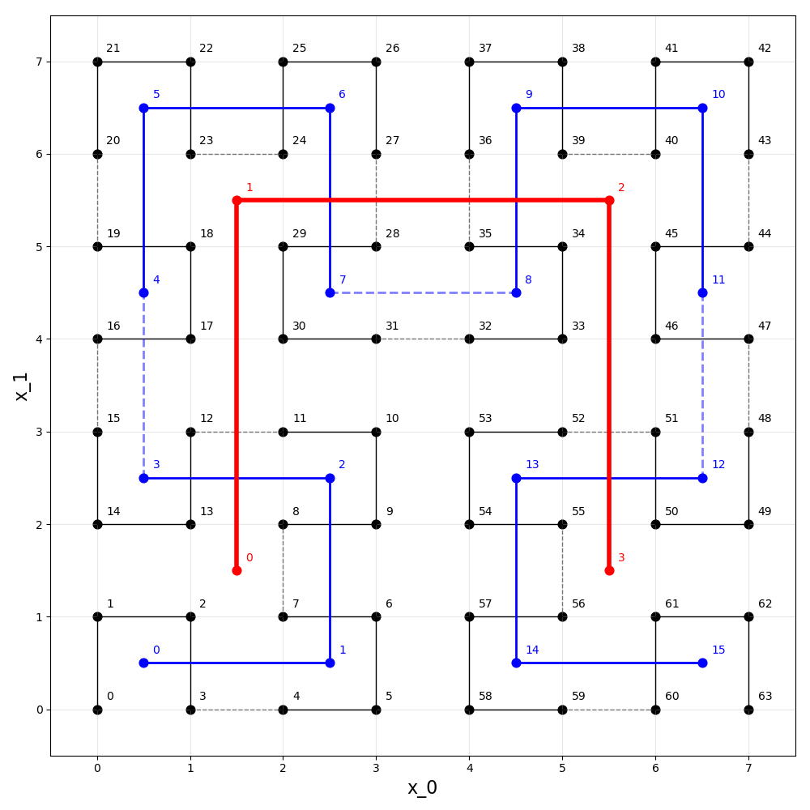

# Introduction

This is a module to convert between one dimensional distance along a
[Hilbert curve][1], `h`, and N-dimensional coordinates,
`(x_0, x_1, ... x_N-1)`.  The two important parameters are `N`
(the number of dimensions, must be > 0) and `p` (the number of
iterations used in constructing the Hilbert curve, must be > 0).

We consider an N-dimensional [hypercube][2] of side length `2^p`.
This hypercube contains `2^{N p}` unit hypercubes (`2^p` along
each dimension).  The number of unit hypercubes determine the possible
discrete distances along the Hilbert curve (indexed from `0` to
`2^{N p} - 1`).


# Quickstart

```python
from hilbert import HilbertCurve
p=1; N=2
hilbert_curve = HilbertCurve(p, N)
for ii in range(4):
    coords = hilbert_curve.coordinates_from_distance(ii)
    print(f'coords(h={ii}) = {coords}')
```

    coords(h=0)=[0, 0]
    coords(h=1)=[0, 1]
    coords(h=2)=[1, 1]
    coords(h=3)=[1, 0]


# Visuals

The image below illustrates the situation for
the first three iterations in two dimensions.



   The figure above shows the first three iterations of the Hilbert
   curve in two (`N=2`) dimensions.  The `p=1` iteration is shown
   in red, `p=2` in blue, and `p=3` in black.
   For the `p=3` iteration, distances, `h`, along the curve are
   labeled from 0 to 63 (i.e. from 0 to `2^{N p}-1`).  The `hilbert` module
   provides methods to translate between N-dimensional coordinates and one
   dimensional distance.  For example, between (`x_0=4, x_1=6`) and
   `h=36`.
   Note that the `p=1` and `p=2` iterations have been scaled and translated
   to the coordinate system of the `p=3` iteration.


An animation of the same case in 3-D is available on YouTube.  To watch the video,
click the link below.  Once the YouTube video loads, you can right click on it and
turn "Loop" on to watch the curve rotate continuously.

[](https://www.youtube.com/watch?v=TfJEJidwkBQ)


# Reference

This module is based on the C code provided in the 2004 article
"Programming the Hilbert Curve" by John Skilling,

  - http://adsabs.harvard.edu/abs/2004AIPC..707..381S

I was also helped by the discussion in the following stackoverflow post,

  - [mapping-n-dimensional-value-to-a-point-on-hilbert-curve][3]

which points out a typo in the source code of the paper.  The Skilling code
provides two functions ``TransposetoAxes`` and ``AxestoTranspose``.  In this
case, Transpose refers to a specific packing of the integer that represents
distance along the Hilbert curve (see below for details) and
Axes refer to the N-dimensional coordinates.  Below is an excerpt from the
documentation of Skilling's code,

```
//+++++++++++++++++++++++++++ PUBLIC-DOMAIN SOFTWARE ++++++++++++++++++++++++++
// Functions: TransposetoAxes  AxestoTranspose
// Purpose:   Transform in-place between Hilbert transpose and geometrical axes
// Example:   b=5 bits for each of n=3 coordinates.
//            15-bit Hilbert integer = A B C D E F G H I J K L M N O is stored
//            as its Transpose
//                   X[0] = A D G J M                X[2]|
//                   X[1] = B E H K N    <------->       | /X[1]
//                   X[2] = C F I L O               axes |/
//                          high  low                    0------ X[0]
//            Axes are stored conveniently as b-bit integers.
// Author:    John Skilling  20 Apr 2001 to 11 Oct 2003
```


[1]: https://en.wikipedia.org/wiki/Hilbert_curve
[2]: https://en.wikipedia.org/wiki/Hypercube
[3]: http://stackoverflow.com/questions/499166/mapping-n-dimensional-value-to-a-point-on-hilbert-curve
